<div align="center">

# 👋 Olá, eu sou Danilo de Lima Fiod

### Desenvolvedor PHP / Laravel | Back-end | APIs REST | Full Stack

Desenvolvedor focado no ecossistema **PHP**, com projetos envolvendo aplicações web, e-commerces, APIs REST e sistemas back-end utilizando **Laravel, Symfony, MySQL, PostgreSQL, Redis, Vue, React e TypeScript**.

📍 São Paulo, SP — Brasil

🌐 [**Acessar meu Portfólio**](https://danjoli.github.io/portfolio/)

</div>

---

## 👨‍💻 Sobre mim

- 🎓 Formado em **Análise e Desenvolvimento de Sistemas**
- 🐘 Foco em **PHP, Laravel e desenvolvimento Back-end**
- 🔗 Desenvolvimento e consumo de **APIs REST**
- 🗄️ Experiência com **MySQL e PostgreSQL**
- 🧪 Testes automatizados com **Pest e PHPUnit**
- 🏗️ Interesse em arquitetura, boas práticas, POO e qualidade de software
- 💼 Buscando oportunidade como **Desenvolvedor PHP/Laravel Júnior**

---

# 🛠️ Tech Stack

### Back-end


### Front-end


### Dados, testes & ferramentas


---

# 🚀 Projetos

Meu portfólio foi estruturado para explorar diferentes formas de desenvolvimento com **PHP**, evoluindo de aplicações Laravel monolíticas até APIs desacopladas, PHP puro, fundamentos internos de frameworks e Symfony.

| # | Projeto | Stack principal | Foco |
|---|---|---|---|
| 1 | 👗 **Malu Store** | Laravel • Blade • Tailwind • MySQL | E-commerce Laravel monolítico completo |
| 2 | 📚 **Lume** | Laravel • Blade • Tailwind • MySQL | Regras de negócio e organização de projeto |
| 3 | 🖥️ **Tech Store** | Laravel • Inertia • Vue 3 • TypeScript • PostgreSQL | Laravel com frontend SPA-like |
| 4 | 🎮 **Game Store** | Laravel REST API • React • TypeScript • PostgreSQL | Frontend e backend desacoplados |
| 5 | ✅ **TaskFlow API** | Laravel • Sanctum • PostgreSQL • Redis • Pest • OpenAPI | API REST, autenticação, autorização e testes |
| 6 | 🏢 **Sistema de Gestão PHP** | PHP • Composer • MVC • PDO • MySQL • PHPUnit | PHP puro, POO, arquitetura e SQL avançado |
| 7 | 🧱 **Mini Framework PHP** | PHP • Composer • PSR • PDO | Fundamentos internos de frameworks |
| 8 | 🔐 **Identity Service** | Symfony • Doctrine • PostgreSQL • PHPUnit | Symfony, autenticação e ecossistema PHP |

---

# ⭐ Projetos em Destaque

## 👗 Malu Store

**Laravel • Blade • Tailwind CSS • MySQL**

E-commerce completo desenvolvido com arquitetura monolítica Laravel, cobrindo o fluxo entre catálogo, carrinho, checkout, pagamento, logística e administração.

`E-commerce` `Laravel` `MySQL` `Pagamentos` `Frete` `Webhooks`

**Principais recursos**

- Catálogo com categorias, produtos e variantes
- Carrinho e checkout
- Autenticação e endereços
- Gestão de pedidos
- Painel administrativo
- Dashboard com indicadores
- Integração com pagamentos
- Integração com serviço de frete
- Webhooks

**Foco técnico:** desenvolvimento de uma aplicação Laravel completa envolvendo múltiplas regras de negócio e integrações externas.

---

## 🖥️ Tech Store

**Laravel • Inertia.js • Vue 3 • TypeScript • PostgreSQL**

E-commerce desenvolvido para explorar a integração entre Laravel e um frontend moderno sem separar completamente as duas aplicações.

`Laravel` `Inertia` `Vue` `TypeScript` `PostgreSQL`

**Arquitetura**

`Laravel → Inertia.js → Vue 3 + TypeScript`

**Principais recursos**

- Catálogo de produtos
- Marcas e categorias
- Produtos e variantes
- Gerenciamento de imagens
- Painel administrativo
- Componentização com Vue
- Tipagem com TypeScript
- Validação
- Testes automatizados

**Foco técnico:** desenvolvimento SPA-like mantendo Laravel como núcleo da aplicação.

---

## 🎮 Game Store

**Laravel REST API • React • TypeScript • PostgreSQL**

Aplicação full stack construída com frontend e backend independentes.

`REST API` `Laravel` `React` `TypeScript` `PostgreSQL`

**Arquitetura**

`React + TypeScript → HTTP/JSON → Laravel REST API → PostgreSQL`

**Back-end**

- REST API com Laravel
- PostgreSQL
- Form Requests
- API Resources
- Services
- Autenticação
- Validação e regras de negócio

**Front-end**

- React
- TypeScript
- Vite
- Consumo da API
- Componentização
- Gerenciamento de estado

**Foco técnico:** comunicação entre frontend e backend completamente desacoplados através de uma API REST.

---

## ✅ TaskFlow API

**Laravel • Sanctum • PostgreSQL • Redis • Pest • OpenAPI**

Projeto focado exclusivamente em desenvolvimento back-end e construção de uma API preparada para ser consumida por diferentes clientes.

`REST API` `Sanctum` `Redis` `Pest` `OpenAPI`

**Principais recursos**

- API REST
- Autenticação com Sanctum
- Autorização e permissões
- Gestão de usuários, projetos e tarefas
- PostgreSQL
- Cache com Redis
- Jobs e filas
- Paginação e filtros
- Tratamento padronizado de erros
- Testes automatizados com Pest
- Documentação OpenAPI

**Foco técnico:** APIs REST robustas, autenticação, autorização, cache, testes e documentação.

---

# 🧩 Outros Projetos

## 📚 Lume

**Laravel • Blade • Tailwind CSS • MySQL**

Livraria virtual com foco em **organização de projeto e regras de negócio**, incluindo catálogo de livros, autores, editoras, categorias hierárquicas, carrinho, pedidos, avaliações, lista de desejos e dashboard administrativo.

**Foco técnico:** evolução da arquitetura Laravel, Services, Form Requests e separação de responsabilidades.

---

## 🏢 Sistema de Gestão PHP

**PHP • Composer • MVC • PDO • MySQL • PHPUnit**

Sistema administrativo desenvolvido sem framework full stack, utilizando **PHP orientado a objetos**, arquitetura MVC, Composer, autoload PSR-4, PDO, autenticação, controle de acesso, módulos gerenciais, relatórios, transações e consultas SQL avançadas.

**Foco técnico:** demonstrar domínio de PHP além do Laravel e compreensão dos fundamentos utilizados por frameworks.

---

## 🧱 Mini Framework PHP

**PHP • Composer • PSR • PDO**

Framework PHP desenvolvido do zero para implementar conceitos como:

`Front Controller → Router → Middleware → Controller → Service → Response`

Inclui Request/Response, roteamento, middlewares, Dependency Injection, Service Container, autoload PSR-4, PDO e tratamento de exceções.

**Foco técnico:** compreender como frameworks PHP funcionam internamente.

---

## 🔐 Identity Service

**Symfony • Doctrine ORM • PostgreSQL • PHPUnit**

Serviço de identidade e autenticação construído com Symfony, explorando cadastro, login, autenticação, autorização, roles, permissões, Doctrine ORM, Dependency Injection, Services, Repositories e testes automatizados.

**Arquitetura**

`Client → Symfony API → Doctrine ORM → PostgreSQL`

**Foco técnico:** expandir o conhecimento além do Laravel e trabalhar com outro importante ecossistema PHP.

---

# 🧠 Fundamentos & Práticas

```text
PHP moderno            APIs REST             SQL
POO                    HTTP / JSON           Modelagem de dados
SOLID                  Autenticação          Migrations
MVC                    Autorização           ORM / PDO
Design Patterns        Webhooks              Transações
Dependency Injection   OpenAPI               Git / GitHub
Composer               Testes automatizados  Pull Requests
PSR / Autoload         Pest / PHPUnit        Code Review
```

---

# 📊 GitHub Stats

<div align="center">





</div>

---

# 📫 Contato

<div align="center">

Estou aberto a oportunidades como **Desenvolvedor PHP / Laravel Júnior**, especialmente em desenvolvimento back-end e APIs.

<br>

[](https://danjoli.github.io/portfolio/)
[](https://github.com/Danjoli)
[](https://www.linkedin.com/in/danilo-de-lima-fiod-73806522a/)

</div>

---

<div align="center">

### 🐘 PHP • Laravel • Symfony • APIs REST • PostgreSQL • MySQL

**Desenvolvendo software para transformar conhecimento técnico em experiência prática.**

</div>
